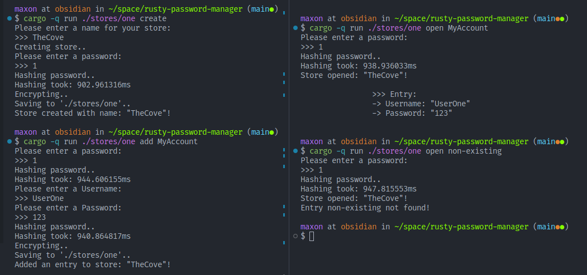

## Rust(y) password manager
Cryptographically secure (but very basic) password manager,  
Practicing cryptography implementations in Rust.

This is the repository of the code that was presented in a post on my blog,  
Check it out if you haven't:  
[Blog post: Writing a Secure Password Manager in Rust](http://blog.maxcode.me/posts/writing-secure-password-manager-in-rust/)


### Features:

Implements:
- [Argon2](https://en.wikipedia.org/wiki/Argon2) for password hashing
- [ChaCha20Poly1305](https://en.wikipedia.org/wiki/ChaCha20-Poly1305) for symmetric encryption

Does:
- Saving & Loading of a password struct to disk.
- Adding and removing of "account" entries.

### Screenshot



### Synopsis

```
Usage: rusty-password-manager <Store File> <COMMAND>

Commands:
  open    Open a store (list entries or get entry)
  create  Create new store
  add     Add an entry to an existing store
  remove  Remove an entry from an existing store
  help    Print this message or the help of the given subcommand(s)

Arguments:
  <Store File>  Store path

Options:
  -h, --help     Print help
  -V, --version  Print version
```
### Contributions

Are welcome, let me know of any shortcomings in the code by opening an Issue.

---

Have a nice day!
